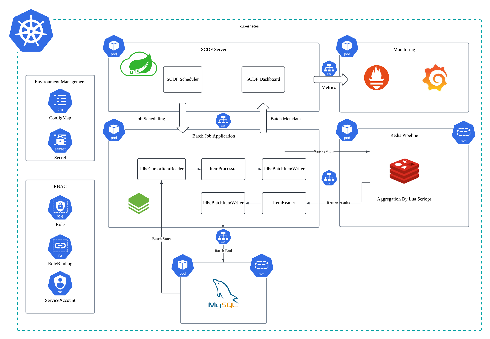

# Introduction

⌛️ 1차 개발 기간: 2025.02.26 ~ 2025.03.16

🚀 개선 작업: 2025.03.16 ~ (진행중)

👨🏻‍💻 프로젝트 소개

이 프로젝트는 Spring Batch를 사용한 일일 정산 시스템으로, 판매자별 주문 및 클레임 데이터를 처리해 일별 정산 내역을 생성합니다. 대용량 데이터 배치 처리 시 발생할 수 있는 성능 이슈를 개선하고, 배치 스케줄링의 운영 효율성을 높이는 사이드 프로젝트 입니다.

# Stack

- Java
- Spring Batch
- Spring Cloud Data Flow
- MySQL, Redis
- RabbitMQ
- Prometheus, Grafana
- Kubernetes

# Architecture 

<figure align="center">

<figcaption></figcaption>
</figure>

# 목차 

- <a href="https://seung-il-bang.github.io/spring%20batch/2025/03/22/Spring-Batch-high-volume-processing/" target="_blank">Spring Batch 대용량 처리의 이해</a>
- <a href="https://seung-il-bang.github.io/spring%20batch/2025/03/22/Spring-Batch-Optimized-read-strategy/" target="_blank">Spring Batch 효과적인 대량 데이터 리드(Read) 전략</a>
- <a href="https://seung-il-bang.github.io/spring%20batch/2025/03/23/Spring-Batch-Optimized-aggregation/" target="_blank">Spring Batch 데이터 집계(Aggregation) 최적화</a>
- <a href="https://seung-il-bang.github.io/spring%20batch/2025/03/23/Spring-Batch-Optimized-Write/" target="_blank">Spring Batch 효율적인 대량 데이터 Write 전략</a>
- <a href="https://seung-il-bang.github.io/spring%20batch/spring%20cloud%20data%20flow/kubernetes/2025/03/23/Spring-Batch-SCDF-k8s/" target="_blank">Spring Cloud Data Flow와 Kubernetes를 활용한 효과적인 배치 구동 환경 구축</a>